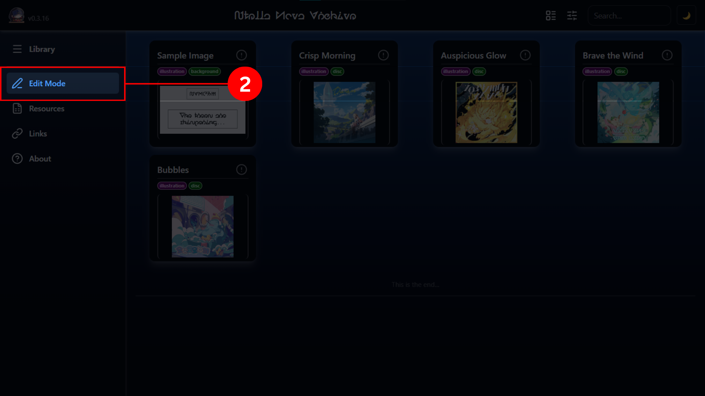
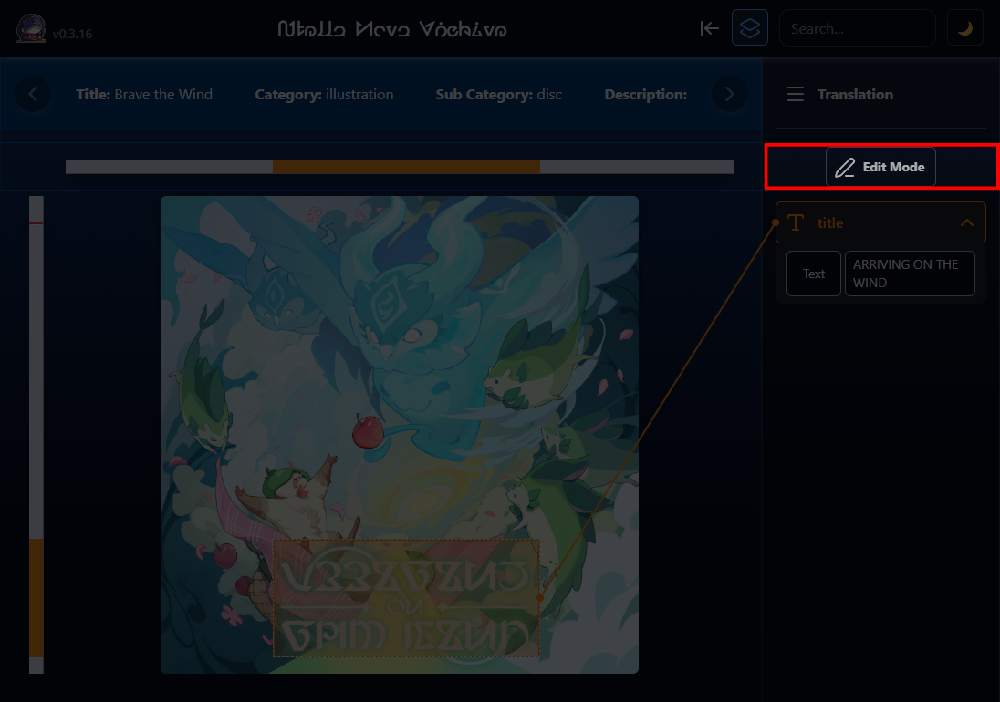

# CONTRIBUTION

This is the documentation on how to contribute to this database. The following is what you can do for us:

- getting [image assets](#image-assets)
- apply [translation overlays](#translation-overlays)

## Image Assets

You must have images of **Stella Sora content with Nova text**, preferably at least HD level (>1000 pixels for both width/height).

Images you have **must either have extension `webp` or `png`** (better if both)

You must know how to use GitHub, then fork this repository.

> If you don't know how to use GitHub and want to contribute regardless, skip this guide and join [Discord server](https://discord.gg/WbVEx5r8a8), then send assets in designated channel.

If you had all that sorted out, next is steps on how to contribute:

1. checkout to branch `data-modify` and make changes there.
2. Put images in the right [category](../template/template.md/#category) and [sub-category](../template/template.md/#sub-category) directory in [assets/](/assets/)
3. Name your images with the following [format](../template/format.md/#format)
4. After you've done this for all the assets, open a PR and state what you've added in the PR description. (You can also request for more category/sub-category here if it doesn't exist)
5. Wait for review. (and merge)

## Translation Overlays

> What is translation overlay?
>
> An overlay region that covers a **Nova text** area on the image content. It's attribute can be modified to **move, resize, rotate, shear** the overlay transform, and also to apply **text translation** of the text content the overlay covers for translation information.

To contribute, you must know how to use GitHub, then fork this repository.

> If you don't know how to use GitHub and want to contribute regardless, follow the guide at **step 2-5**, join [Discord server](https://discord.gg/WbVEx5r8a8), send `json` file in designated channel there.

Steps on how to contribute:

1. checkout to branch `data-modify` and make changes there.
2. Open [Stella Nova Archive](https://bb-69.github.io/stella-nova-archive/#/browse) site and click `Edit Mode` to enter edit session.

   

   > Note: The following session cannot be saved (for now). Make sure you make changes and get necessary data in one go before you quit the session.

3. Upload an image you want to apply overlays. Preferably if it already exists inside [assets/](../assets/) directory.
4. Modify metadata and tweak overlays until done.
5. Get `json` file of the changes you have made.

   

6. After you've done your satisfaction amount, open a PR and state what you've added in the PR description.
7. Wait for review. (and merge)

### Bonus

You can enter edit session directly from view mode. This will use existing data of the content you are viewing. You can use this as a reference, or to tweak or experiment, whatever floats your mind.

